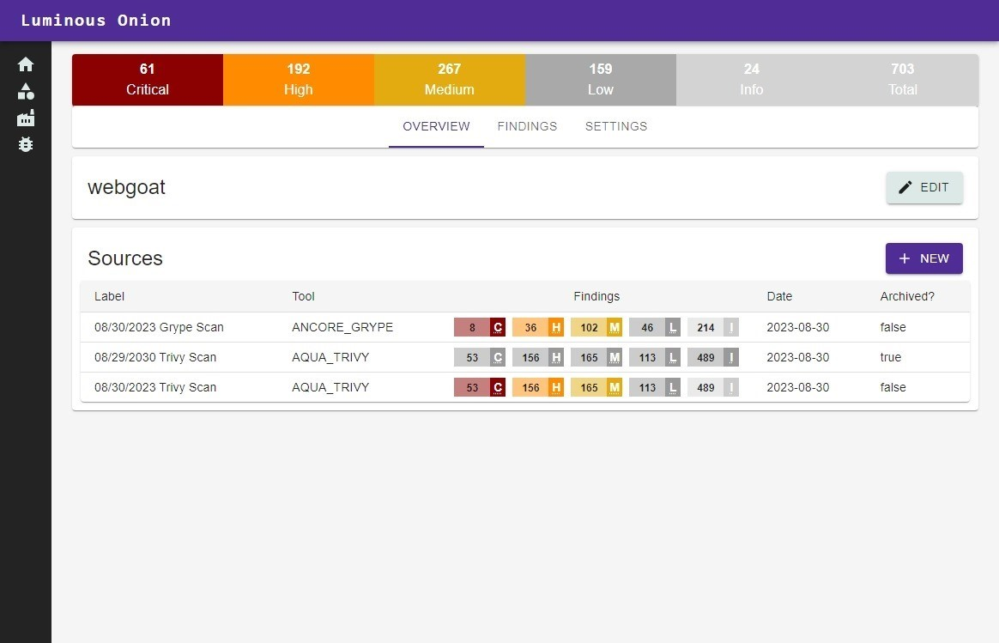

<p align="center" width="100%">


<h2 align="center">Luminous Onion </h2>
</p>

---

<div align="center">


[](https://sonarcloud.io/summary/new_code?id=zkarpinski_Luminous-Onion)
[](https://hub.docker.com/r/zkarpinski/luminous-onion/tags)
</div>

---

## Resumen
Luminous Onion es una aplicación web de vanguardia diseñada para revolucionar la gestión de vulnerabilidades mediante la ingestión fluida de informes de seguridad de diversas herramientas de terceros. Con su interfaz intuitiva y potentes características, Luminous Onion capacita a las organizaciones para controlar su postura de ciberseguridad como nunca antes.




## Configuración
Versión de Java: **17**

## Compilación y Pruebas
Para simplificar, puede utilizar el script adjunto `buildAndPackageScript.cmd`. De lo contrario, a continuación se presentan los pasos para empaquetar y compilar en una imagen de Docker.
1. En la raíz del proyecto, ejecute `mvn package`, lo cual compila el back-end de Spring Boot y el front-end de Node.
2. A continuación, ejecute `docker build -t "luminous-onion" .` para construir la imagen de Docker.
3. Ejecute `docker run -d -P luminous-onion` para ejecutar la imagen de Docker.

## Despliegue
Para las instrucciones de despliegue, consulte [Deployment README](deployment/terraform/README.md)

## Inicio Rápido
```sh
git clone
cd LuminousOnion
./buildAndPackage.sh
```

## Ejemplos y Muestras
Los scripts de ejemplo y los archivos de resultados de muestra están disponibles en `examples/`. En Windows, recomendamos usar Ubuntu-22.04 con WSL2. Consulte [Docker on WSL](https://docs.docker.com/desktop/wsl/) e [Install WSL on Windows](https://docs.docker.com/desktop/wsl/)

## Recursos
1. https://developer.okta.com/blog/2022/06/17/simple-crud-react-and-spring-boot


## Características
* **Ingestión Unificada:** Luminous Onion actúa como un punto central para todos sus informes de seguridad. Se conecta sin problemas con una amplia gama de herramientas de seguridad de terceros, recopilando datos de escáneres de vulnerabilidades, herramientas de pruebas de penetración y más. Diga adiós a los silos de información y a la fragmentación de datos.

* **Visualización Integral:** Transformar datos de seguridad en bruto en información valiosa es sencillo con Luminous Onion. La aplicación ofrece una amplia gama de visualizaciones interactivas como gráficos, diagramas y mapas de calor, lo que le permite comprender el panorama de vulnerabilidades de un vistazo. Identifique tendencias, puntos críticos y amenazas potenciales con facilidad.

* **Priorización Inteligente:** Luminous Onion incorpora algoritmos avanzados para evaluar automáticamente la gravedad de las vulnerabilidades. Prioriza los riesgos basándose en factores como la puntuación CVSS, la criticidad de los activos y el posible impacto empresarial. Esta función inteligente agiliza la toma de decisiones, asegurando que su equipo se centre en los problemas más críticos primero. _(Próximamente.)_

* **Flujo de Trabajo Colaborativo:** La colaboración se encuentra en el corazón del diseño de Luminous Onion. Permite que los equipos multidisciplinarios trabajen juntos sin problemas. Agregue comentarios, asigne tareas y realice un seguimiento del progreso de los esfuerzos de remediación dentro de la aplicación. Fomente la colaboración entre analistas de seguridad, desarrolladores y personal de TI para mejorar los tiempos de respuesta. _(Próximamente.)_

* **Informes Personalizables:** Genere informes detallados sin esfuerzo con el módulo de informes personalizable de Luminous Onion. Adapte los informes a las necesidades de su organización, incorporando métricas, gráficos y resúmenes ejecutivos. Mantenga informadas a las partes interesadas sobre la postura de seguridad en un lenguaje que entiendan. _(Próximamente.)_

* **Monitoreo en Tiempo Real:** Manténgase al día con el monitoreo en tiempo real de vulnerabilidades. El panel de control en vivo de Luminous Onion proporciona actualizaciones instantáneas a medida que se ingieren y analizan nuevos informes de seguridad. Responda rápidamente a amenazas emergentes y cambios en el panorama de riesgos.

* **Capacidades de Integración:** Extienda el poder de Luminous Onion integrándolo con su infraestructura de seguridad existente. Conéctese sin problemas con sistemas de tickets, herramientas de comunicación y plataformas de automatización de flujos de trabajo para crear un ecosistema de seguridad cohesionado con nuestras APIs abiertas.

## ¿Por qué elegir Luminous Onion:

* **Simplicidad:** La interfaz fácil de usar de Luminous Onion hace que la gestión de vulnerabilidades sea accesible para interesados tanto técnicos como no técnicos.
* **Eficiencia:** La evaluación automatizada de riesgos, la priorización y las funciones colaborativas aceleran el proceso de remediación de vulnerabilidades.
* **Perspectiva:** Las visualizaciones y analíticas ofrecen información profunda sobre las vulnerabilidades, facilitando la toma de decisiones estratégicas.
* **Precisión:** Los algoritmos avanzados garantizan una puntuación de riesgos precisa, mejorando la precisión de su estrategia de gestión de vulnerabilidades.
* **Agilidad:** Las actualizaciones en tiempo real y las capacidades de integración permiten respuestas rápidas a amenazas en evolución.

## Asegure su Futuro con Luminous Onion:

Luminous Onion capacita a las organizaciones para navegar el complejo panorama de vulnerabilidades de ciberseguridad con confianza. Revelar el verdadero potencial de su estrategia de gestión de vulnerabilidades y proteger sus activos digitales con una herramienta que pone la claridad, la colaboración y el control en primer plano. Descubra una nueva era de gestión de ciberseguridad con Luminous Onion.
