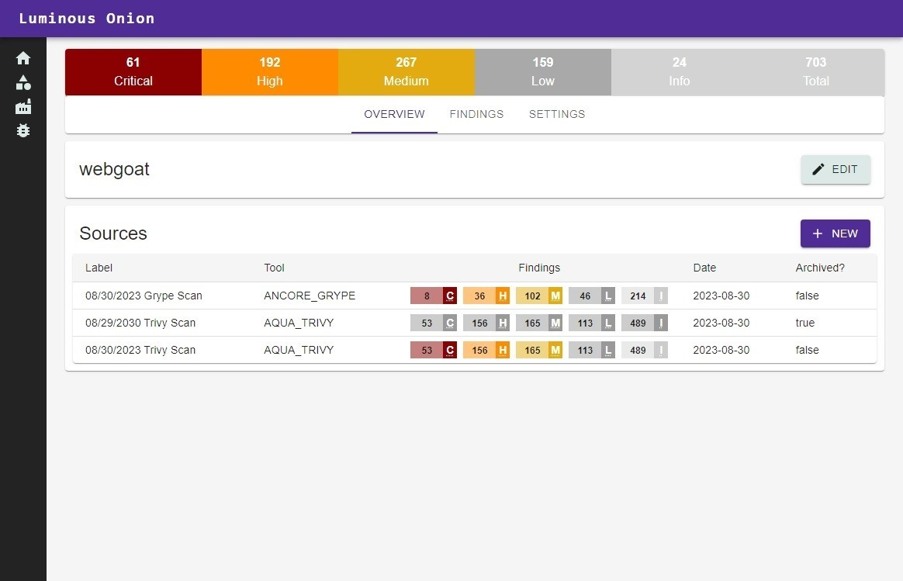

<p align="center" width="100%">


<h2 align="center">Luminous Onion </h2>
</p>

---

<div align="center">


[](https://sonarcloud.io/summary/new_code?id=zkarpinski_Luminous-Onion)
[](https://hub.docker.com/r/zkarpinski/luminous-onion/tags)

</div>

---

## Summary

Luminous Onion is a cutting-edge web application designed to revolutionize vulnerability management by seamlessly ingesting security reports from a variety of 3rd party tools. With its intuitive interface and powerful features, Luminous Onion empowers organizations to take charge of their cybersecurity posture like never before.



## Setup

Java Version: **17**

## Build & Test

To simplify, you may use the accompanying `buildAndPackageScript.cmd` script. Otherwise below are the steps to package and build into a docker image.

1. In the root of the project, run `mvn package` which builds the springboot back-end and node front-end.
2. Next run `docker build -t "luminous-onion" .` to build the docker image
3. Execute `docker run -d -P luminous-onion` to run the docker image.

## Deployment

For deployment instructions, see [Deployment README](deployment/terraform/README.md)

## Quick Start

```sh
git clone
cd LuminousOnion
./buildAndPackage.sh
```

## Examples & Samples

Example scripts and sample result files are available in `examples/`. On Windows, we recommend using Ubuntu-22.04 with WSL2. See [Docker on WSL](https://docs.docker.com/desktop/wsl/) and [Install WSL on Windows](https://docs.docker.com/desktop/wsl/)

## Resources

1. https://developer.okta.com/blog/2022/06/17/simple-crud-react-and-spring-boot

## Features

- **Unified Ingestion:** Luminous Onion acts as a central hub for all your security reports. It seamlessly connects with a wide range of 3rd party security tools, collecting data from vulnerability scanners, penetration testing tools, and more. Say goodbye to information silos and data fragmentation.

- **Comprehensive Visualization:** Transforming raw security data into meaningful insights is effortless with Luminous Onion. The application offers an array of interactive visualizations such as graphs, charts, and heat maps, allowing you to grasp the vulnerability landscape at a glance. Pinpoint trends, hotspots, and potential threats with ease.

- **Intelligent Prioritization:** Luminous Onion incorporates advanced algorithms to automatically assess the severity of vulnerabilities. It prioritizes risks based on factors like CVSS score, asset criticality, and potential business impact. This smart feature streamlines decision-making, ensuring that your team focuses on the most critical issues first. _(Coming soon.)_

- **Collaborative Workflow:** Collaboration lies at the heart of Luminous Onion's design. It enables cross-functional teams to work together seamlessly. Add comments, assign tasks, and track the progress of remediation efforts within the application. Foster collaboration among security analysts, developers, and IT personnel to enhance response times. _(Coming soon.)_

- **Customizable Reporting:** Generate insightful reports effortlessly with Luminous Onion's customizable reporting module. Tailor reports to suit your organization's needs, incorporating metrics, charts, and executive summaries. Keep stakeholders informed about the security posture in a language they understand. _(Coming soon.)_

- **Real-time Monitoring:** Stay in the loop with real-time monitoring of vulnerabilities. Luminous Onion's live dashboard provides instant updates as new security reports are ingested and analyzed. Respond swiftly to emerging threats and changes in the risk landscape.

- **Integration Capabilities:** Extend the power of Luminous Onion by integrating it with your existing security infrastructure. Seamlessly connect with ticketing systems, communication tools, and workflow automation platforms to create a cohesive security ecosystem with our open APIs.

## Why Choose Luminous Onion:

- **Simplicity:** Luminous Onion's user-friendly interface makes vulnerability management accessible to both technical and non-technical stakeholders.
- **Efficiency:** Automated risk assessment, prioritization, and collaborative features accelerate the vulnerability remediation process.
- **Insight:** Visualizations and analytics offer deep insights into vulnerabilities, aiding strategic decision-making.
- **Accuracy:** Advanced algorithms ensure accurate risk scoring, enhancing the precision of your vulnerability management strategy.
- **Agility:** Real-time updates and integration capabilities enable rapid responses to evolving threats.

## Secure Your Future with Luminous Onion:

Luminous Onion empowers organizations to navigate the complex landscape of cybersecurity vulnerabilities with confidence. Unveil the true potential of your vulnerability management strategy and secure your digital assets with a tool that brings clarity, collaboration, and control to the forefront. Discover a new era of cybersecurity management with Luminous Onion.
